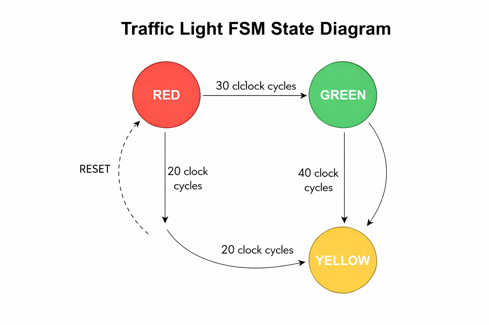
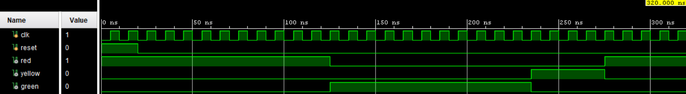

# FSM-Based Traffic Light Controller using Verilog

This project implements a **Traffic Light Controller** using a **Finite State Machine (FSM)**
in **Verilog HDL**. The design is simulated and verified using **Xilinx Vivado**
without any physical hardware.

---

## Overview
Traffic signals operate in a fixed sequence to ensure safe and efficient traffic flow.
This project models a basic traffic light system with three states:
- RED
- GREEN
- YELLOW

Each state remains active for a fixed duration controlled by a timer.

---

## Core Idea
- FSM-based design (Moore Machine)
- Clock-driven state transitions
- Outputs depend only on the current state
- Separate testbench used for verification

---

## Tools Used
- Verilog HDL
- Xilinx Vivado (Behavioral Simulation)

---

## Project Structure
src/ -> RTL design (traffic_light.v)
tb/ -> Testbench (traffic_light_tb.v)
docs/ -> FSM state diagram
simulation/ -> Simulation waveform

---

## Simulation Results
The design was verified using Vivado behavioral simulation.
The waveform confirms:
- Correct reset behavior
- Proper FSM state transitions
- Only one traffic light active at a time

### FSM Diagram

### Simulation Waveform

---

## Applications
- Traffic signal automation
- FSM-based control systems
- Learning RTL design and verification

---

## Future Enhancements
- Pedestrian signal integration
- Adaptive traffic timing
- FPGA board implementation

---

## Author
Khushi

